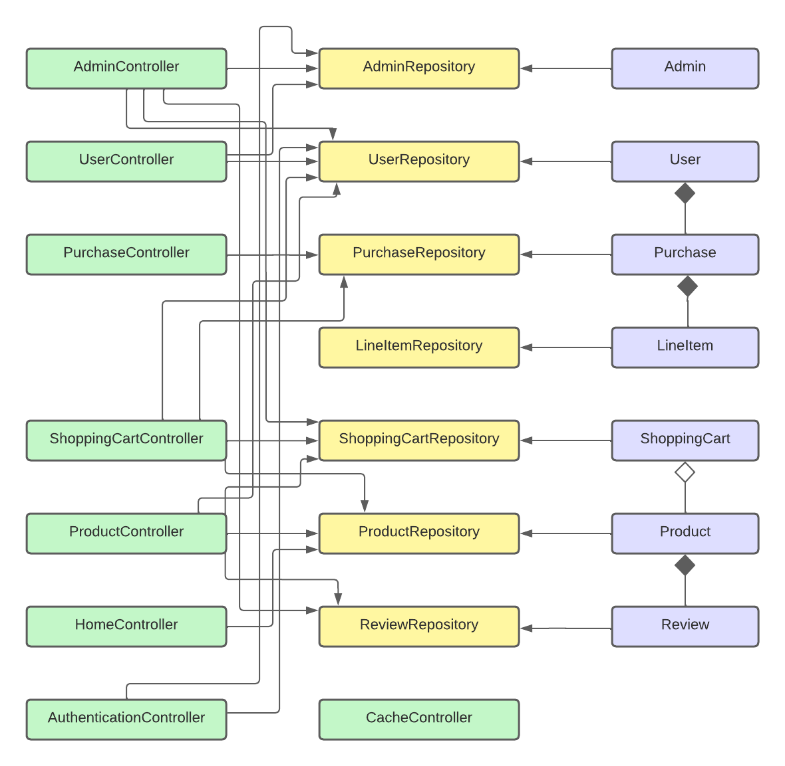
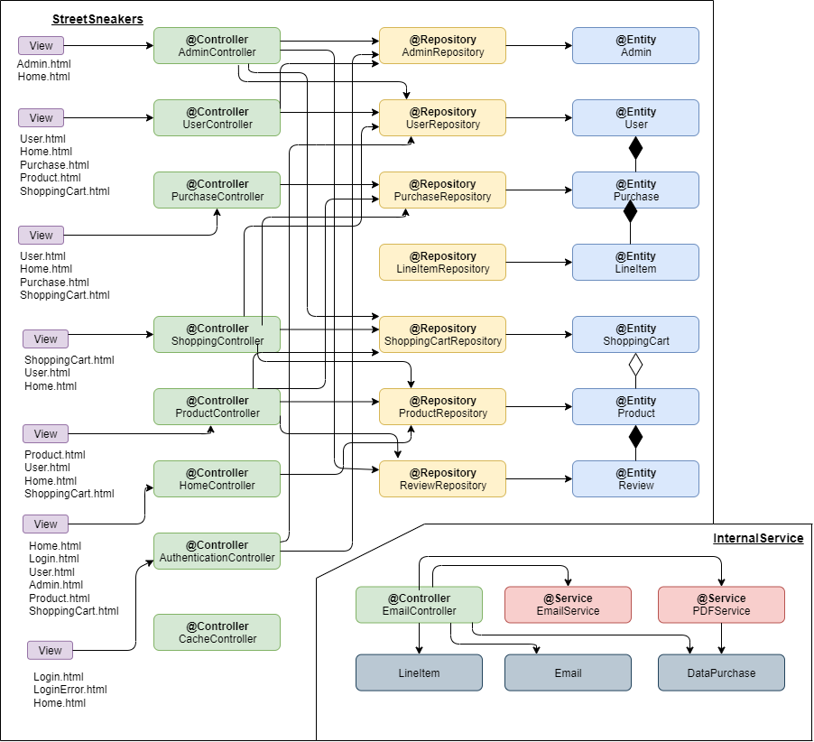

# StreetSneakers
Repositorio para la práctica de Desarrollo de Aplicaciones Distribuida (DAD) de la URJC.

## Integrantes
Alberto Martín Amengual:  
:octocat: [Albertomartin21](https://github.com/Albertomartin21)  
:envelope: a.martinam.2017@alumnos.urjc.es  
Fátima Ezahra Smounat Mahidar:  
:octocat: [ezi2000](https://github.com/ezi2000)  
:envelope: fe.smounat.2018@alumnos.urjc.es  
Raúl Heredia Horcajo:  
:octocat: [raulhh2000](https://github.com/raulhh2000)  
:envelope: r.heredia.2018@alumnos.urjc.es


## :open_book:Tabla de contenido

- [FASE 1](#fase-1)
    - [Descripción de la aplicación web](#descripción-de-la-aplicación-web)
    - [Funcionalidades](#funcionalidades)
    - [Entidades](#entidades)
    - [Funcionalidades del servicio interno](#funcionalidades-del-servicio-interno)
- [FASE 2](#fase-2)
    - [Capturas de pantalla](#capturas-de-pantalla)
    - [Diagrama de navegación](#diagrama-de-navegación)
    - [Diagrama UML](#diagrama-uml)
    - [Diagrama de clases](#diagrama-de-clases)
    - [Diagrama de Entidad Relación](#diagrama-de-entidad-relación)
- [FASE 3](#fase-3)
    - [Diagrama de clases con templates](#diagrama-de-clases-con-templates)
    - [Instrucciones de instalación](#instrucciones-de-instalación)
    	- [Pre requisitios](#pre-requisitios)
    	- [Instalación](#instalación)
- [Licencia](#licencia)

## FASE 1

### Descripción de la aplicación web
`StreetSneakers` es una aplicación web de consulta :newspaper: y venta online :shopping_cart: de las mejores zapatillas :athletic_shoe: del mercado.

### Funcionalidades
```
-Funcionalidades públicas: El usuario al acceder a la página sin registrarse va a poder ver todas las
zapatillas en venta y además consultar las últimas novedades del mundo de las Sneakers.

-Funcionalidades privadas: El usuario una vez registrado tendrá acceso a realizar pedidos, consultar sus
últimos pedidos, tener una lista de deseados, hacer reseñas de zapatillas y hablar por un chat compartido
entre usuarios de la web.
```
### Entidades
```
-Administrador: Representa a los administradores del sistema. Realizarán la gestión tanto de los productos
como de las cuentas del sistema.

-Usuario: Representa a los clientes del sistema.

-Producto: Representa a los productos del sistema.

-Carrito: Representa a la cesta de productos que desea comprar el usuario.

-Pedido: Representa el pedido con los productos seleccionados por el usuario.

-Reseña: Representa a la reseña de un producto realizada por un usuario.

-Noticia: Representa a las noticias del sistema.
```
### Funcionalidades del servicio interno
```
-Envío de correo electrónico al usuario tras registrarse y al realizar un pedido.

-Generación de una factura del pedido realizado por el usuario en formato PDF.

-Chat entre todos los usuarios del sistema.
```
## FASE 2
### Capturas de pantalla

#### -Pantalla principal:

En esta pantalla puedes buscar cualquier zapatilla mediante filtros de búsqueda, y acceder a las otras pantallas.
<br /><br />

#### -Pantalla de producto:
&nbsp;&nbsp;  
Se puede ver en detalle todos los datos de un producto en específico, y un usuario podrá añadir el producto tanto a una lista de deseados como al carrito. También podrá realizar, modificar y eliminar una reseña del producto.  
<br />

#### -Pantalla de usuario:


Esta pantalla accederán únicamente los usuarios registrados. En ella se puede modificar los datos del usuario, acceder a la lista de deseados y ver todos los productos que el usuario ha comprado.<br /><br />
  
#### -Pantalla de admin:
&nbsp;&nbsp;
Esta pantalla accederán únicamente los administradores. En ella un administrador puede modificar sus datos, añadir, modificar y eliminar un producto de la tienda, crear un nuevo administrador y eliminar cualquier usuario de la aplicación.
<br /><br />

#### -Pantalla de carrito:

En ella un usuario puede comprobar todos los productos que se han añadido al carrito, quitarlos del mismo y realizar la compra de todos los productos.
<br /><br />

#### -Pantalla del pedido:

En esta pantalla aparece todos los datos del pedido que ha realizado un usuario.
<br /><br />

### Diagrama de navegación


### Diagrama UML


### Diagrama de clases


### Diagrama de Entidad Relación


## FASE 3
### Diagrama de clases con templates


### Instrucciones de instalación
<details>
    <summary><h4>Pre requisitios</h4></summary>
<hr>

Para descargar una copia local del proyecto se requiere tener en la máquina los siguientes programas:  
* Se recomienda antes de instalar programas actualizar los repositorios de paquetes, ejecutando el siguiente comando:  
	```sh
	$ sudo apt update
	```  
* [Java JRE 11 o superior](https://www.oracle.com/es/java/technologies/javase/jdk11-archive-downloads.html) para instalarlo usar:
	```sh
	$ sudo apt install openjdk-11-jre-headless
	```  
* [Maven](https://maven.apache.org/) para instalarlo usar:
	```sh
	$ sudo apt install maven
	```  
* [MySQL server](https://www.mysql.com/) para instalarlo usar:
    ```sh
	$ sudo apt install mysql-server
	```  
	Añadimos una clave a root:  
	```sh
	$ sudo mysql
	mysql> select user,authentication_string,plugin,host from mysql.user;
	mysql> alter user 'root'@'localhost' identified with mysql_native_password by 'asdf';
	```  
	Recargamos los privilegios de las tablas:  
	```sh
	mysql> flush privileges;
	mysql> select user,authentication_string,plugin,host from mysql.user;
	```  
	Crear un esquema:  
	```sh
	mysql> create schema streetSneakers;
	```  
	Si deseamos salir del terminal:  
	```sh
	mysql> exit;
	```  
	<details>
        <summary><h5>Más información de interes</h5></summary>
	
	Si deseamos entrar otra vez a mysql:  
	```sh
	$ sudo mysql -u root -p
	```  
	Si deseamos consultar los schemas disponibles:  
	```sh
	mysql> show schemas;
	```  
	Si deseamos cambiar de schema:  
	```sh
	mysql> use nombre_schema;
	```  
	Si deseamos borrar un schema:  
	```sh
	mysql> drop schema nombre_schema;
	```  
	Si deseamos hacer una consulta:  
	Si deseamos borrar un schema:  
	```sh
	mysql> select columnas from tabla;
	```  
	Para instalar mysql-workbench-community:  
	```sh
	$ sudo snap install mysql-workbench-community
	$ snap connect mysql-workbench-community:password-manager-service
	$ snap connect mysql-workbench-community:ssh-keys
	```  
	</details>
</details>
<details>
    <summary><h4>Instalación</h4></summary>
  <details>
    <summary><h5>Ejecutar las aplicaciones sin fichero .jar</h5></summary>
    
  Clonar el repositorio:
  ```sh
  git clone https://github.com/raulhh2000/StreetSneakers.git
  ```
  Desde la carpeta raíz del proyecto StreetSneakers y InternalService lanzar el siguiente comando <strong>en terminales diferentes</strong>:
  ```sh
  mvn spring-boot:run
  ```
  </details>
  <details>
    <summary><h5>Ejecutar las aplicaciones generando fichero .jar</h5></summary>
    
  Clonar el repositorio:
  ```sh
  git clone https://github.com/raulhh2000/StreetSneakers.git
  ```
  Desde la carpeta raíz del proyecto StreetSneakers y InternalService, y lanzar el siguiente comando <strong>en terminales diferentes</strong>:
  ```sh
  mvn package
  ```
  Navegar a la carpeta target del proyecto StreetSneakers y InternalService, y lanzar el siguiente comando <strong>en terminales diferentes</strong>:
  ```sh
  java -jar StreetSneakers-0.0.1-SNAPSHOT.jar
  ```
  ```sh
  java -jar InternalService-0.0.1-SNAPSHOT.jar
  ```
  </details>
</details>

## Licencia
Este proyecto está bajo la licencia `Apache License 2.0`. Mira el archivo [LICENSE](LICENSE) para más detalles.